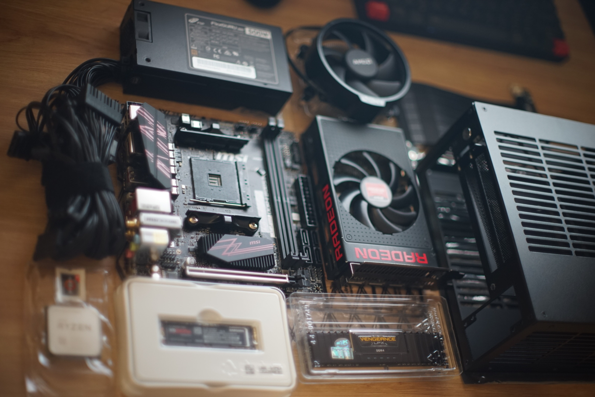

Build a super compact $1100 PC with very respectable CPU performance and good enough GPU performance for high refresh rate e-sport gaming, with Linux as a first class citizen.

TLDR: Get an AMD R9 Nano for about $200, the performance should be a little bit better than the NVIDIA GTX 1060 or AMD RX 580.

## Parts

- CPU: AMD Ryzen 5 5600X
- Motherboard: MSI B450i (this combine with the CPU caused me some inconvinience - more on that later)
- RAM: Corsair 2x16GB 3200MHz DDR4
- GPU: AMD R9 Nano (my initial plan was to go for the AMD RX 6600 XT, temp solution due to the crazy GPU sortage)
- SSD: 970 Evo Plus 500GB

Apart from that I already have the following peripherals:

- LG 1440p 180Hz monitor (for those sweet, sweet frames and low latency - seriously if you play any FPS game, you must try a high refresh rate monitor, you can never go back to 60Hz)
- Wireless gaming mouse, keyboard and headphones

## Build process

### First mistake

By default B450 boards don't support Ryzen 5000 serie, but the BIOS can be upgraded to support them.

I assume that all B450 board has BIOS flashback feature, so I can just:

- Download the new BIOS-
- Put it to a FAT32 formated USB stick
- Plug it in to the main board
- Press the upgrade BIOS button
- Wait 5 minutes and voa la

But I was wrong, terribly wrong!

The ITX mother board series does not support BIOS flashback, so I have to return it to the shop and let them help me by plug in an older Ryzen 3600 and update the BIOS from there.

Lession learned: double check everything before buying new hardware!

### Memory installation

### CPU, heatsink and fan installation

### SSD installation

### PSU installation

### Throw everything in the tiny case

### DJ

In Vietnam we jokingly call step this DJ because it sounds similar to "đi dây" - which means cable management.

## OS configuration

I use Arch btw, but in this article I will not talk about how to install Arch, you can check out my Arch Linux installation guide if you're interested.
Instead, it will show some optimization and automation for the hardware.

### Bluetooth headphones and keyboard

### FreeSync

### HDR

### Steam Proton optimization

### Undervolting

### Automate all of that with Ansible

## Power consumption

Based on TODO, the power draw is TODO. I don't have a TODO so this is just an estimation.

## Benchmark

Below is the benchmark of some games I usually play.

### Overwatch

low settings, 100% render scale:

TODO

### Counter Strike: Global Offensive

low settings, FXAA

TODO

### The Witcher 3

TODO

### Grand Theft Auto V

### Red Dead Redemption 2

## Productivity tasks

## Mining ROI

As you already know, although this is an old GPU but it still cost way more than it should, so I'll let it mine some TODO to make it pay for it self.

My current electricity cost is about ₫3500 ($0.15) per kW.

I get TODO per day if I let it run 24/24.

So my ROI should be around TODO months for the GPU and TODO months for the entire set up, but I also game on it so it should be a bit less.
